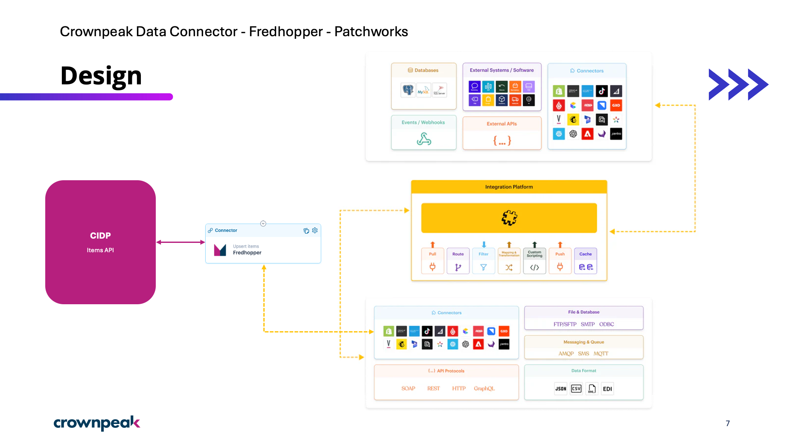
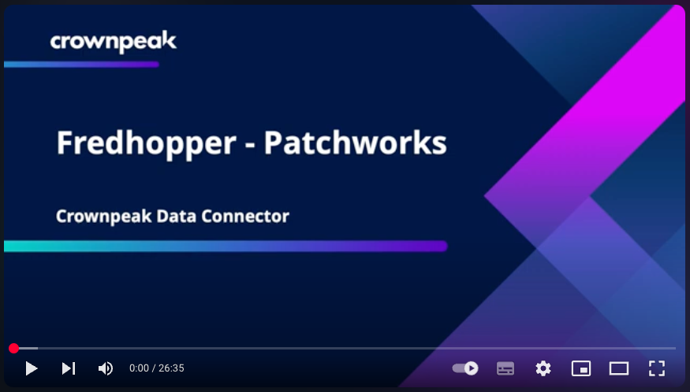

# Patchworks Data Connector for Fredhopper by Crownpeak

## Overview
This README details the Patchworks Data Connector for Fredhopper by Crownpeak. This connector facilitates the integration of Crownpeak's Product Discovery solutions, powered by Fredhopper and XO, with various systems using the Patchworks integration Platform as a Service (iPaaS).
###   What is it?

The Patchworks Data Connector for Fredhopper by Crownpeak provides a pre-built, standardized connection between Crownpeak's Product Discovery Items API (CIDP) and other business systems through the Patchworks iPaaS platform.

Crownpeak’s Product Discovery solutions, powered by Fredhopper and XO, provide AI-driven search, merchandising, and product recommendations. The Items API (CIDP) is a streaming API used to ingest data, including catalog information (products and variants) and content (images, banners), into Fredhopper and XO.

Patchworks is a no-code/low-code iPaaS platform that automates workflows and connects systems. It offers a Connector Marketplace with a library of connectors for eCommerce platforms, ERP, WMS, 3PL, POS systems, and more.

###   What is it for?

The connector addresses the challenge of integrating disparate systems with Fredhopper and XO. It simplifies and accelerates the data integration process, automating data synchronization between systems. This enables businesses to:

* Ensure Fredhopper and XO have access to the latest product information and data.
* Streamline data integrations to grow and expand quickly.
* Drive online global revenue growth with AI-based search, merchandising, and product recommendations.
* Enable seamless re-platforming or introduce new capabilities within their commerce stack.
* Reduce IT costs and complexity associated with custom integrations.
* Experiment with new data sources and personalization strategies.

###   How to Use It
1.  **Authentication:** When adding connector instances of the Patchworks connector, OAuth 2 (client credentials) authentication is used. You will need the following details:

    * Tenant (your Fredhopper username)
    * Environment (your Fredhopper instance, e.g., live1, test1)
    * Scope (leave set to openid)
    * Grant type (leave set to client\_credentials)
    * Client ID (your service account credentials)
    * Client Secret (your service account credentials)
    * Response Authentication Token Key (leave set to access\_token)
    * If you do not have these details, contact your Technical Consultant to request a service account.
2.  **Deployment:** The connector is expected to be installed from the Patchworks Marketplace, and managed by the end-customer or partner.
3.  **Documentation:** Detailed documentation is available in the Patchworks platform, describing what the connector is, how to use it, and how to deploy it.

### Videos & Tutorials
Walk through of building a Patchworks Process Flow using the Patchworks Data Connector for Fredhopper by Crownpeak.

###   Support
* This repository is managed by Crownpeak under the terms of the MIT License.
* The Patchworks Data Connector for Fredhopper by Crownpeak is managed by Patchworks.
* The Fredhopper platform is managed by Crownpeak under the terms of each customer agreement.

###   Roadmap
* **Now:** V1.1 – Patchworks Data Connector for Fredhopper by Crownpeak using CIDP.
* **Next:** Product Discovery Connector using flat-file integration.
* **Future:** Example Patchworks “Process Flows” and “Blueprints ” for the Patchworks Marketplace.

###   Acknowledgements
* Patchworks for providing the robust iPaaS platform that enables these integrations.

##  Legal Notices
Fredhopper Patchworks Data Connector is an example solution subject to the [MIT license](./LICENSE).

This data connector must not be used for any illegal activities or in ways that could harm Crownpeak or Fredhopper's systems.

Copyright © 2025 Crownpeak Technology, Inc. All rights reserved. Fredhopper is a trademark of Crownpeak Technology, Inc.

## Disclaimer
This document is provided for information purposes only. Crownpeak may change the contents hereof without notice. This document is not warranted to be error-free, nor subject to any other warranties or conditions, whether expressed orally or implied in law, including implied warranties and conditions of merchantability or fitness for a particular purpose. Crownpeak specifically disclaims any liability with respect to this document and no contractual obligations are formed either directly or indirectly by this document. The technologies, functionality, services, and processes described herein are subject to change without notice.